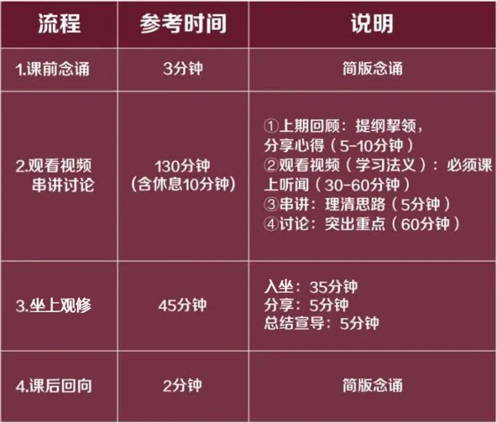

# 学修说明～第三册（四外加行）

[HDZG\_ZEN 慧灯之光禅修](https://mp.weixin.qq.com/mp/homepage?__biz=MzI2NTQ1NDcxNg==&hid=8&sn=3d9136ef9366472153d002863627d36d&scene=18) 9/17

一、第三册（四外加行）学修总述

1

第三册（四外加行）学修需要具备哪些条件？

1

学习的条件是圆满完成前两册教材的学习，个人出勤率达到70%。

2

完成十万遍的莲师心咒或莲师金刚七句祈祷文。

1

上师曾说：“修与不修、解脱与否，还是要看自己。佛也说过：‘吾为汝说解脱道，当知解脱依自己。’如果没有佛和善知识，我们不会知道解脱的方法，一旦方法清楚了，就全要靠自己。”在四外加行修习中，要本着对自己和上师三宝的信心，做好个人预习、课程学修和坐上观修，圆满修学、获得真实受益！

1

此阶段的修持方法主要是遵循上师“慧灯禅修课”的讲解，并参考一些指定法本。（“慧灯禅修课”视频在慧灯之光官网里可以下载或在线观看，地址如下：

1

[http://www.huidengzhiguang.com/index.php/huideng-jiangtang/2016-07-21-09-15-04](http://www.huidengzhiguang.com/index.php/huideng-jiangtang/2016-07-21-09-15-04)）

2

第三册（四外加行）如何学修？

1

本册总学修时长约22个月～24个月（24个月中含2个月总复习）。

2

进入第三册（四外加行）阶段，请严格按照上师教言进行实修，每位师兄应当反复闻思上师教言，做好个人预习、课程学修和坐上观修。

3

第三册（四外加行）学修所用资料有哪些？

第三册（四外加行）学修所用资料包括以下部分：

1

“慧灯禅修课”视频（1～20）

2

《慧灯禅修教材》第三册：教材是综合汇集而成，系统性强，有很多实修的引导

3

《大圆满前行引导文》，又名《大圆满前行 普贤上师言教》（华智仁波切著，索达吉堪布译）（简称“引导文”）

4

辅助参考资料:《前行备忘录》（阿琼堪布著，索达吉堪布译）《菩提道次第广论》（宗喀巴大师著）

注意：①~③是在学修时必学的资料，辅助参考资料是自学内容。

学修时以上师开示视频及指定资料为准，学修时间不要学习、讨论其他法师或居士对于慧灯之光内容的分析解读。

4

第三册（四外加行）学修的流程是怎样的？

1

第三册（四外加行）的学修，按照“课前念诵 — 观看视频（学习法义）— 串讲讨论 — 坐上观修 — 课后回向”的流程进行。从课程衔接考虑，观看视频前可有5分钟的上期回顾时间以便收摄身心、坐上观修后可安排5~10分钟的分享及总结宣导。

下面以学修时间为3小时的为例，介绍学修流程。

1

课前念诵、课后回向可采取简版形式以控制时间。

课前念诵内容：加倍咒（三遍）、皈依发心（三遍）、四无量心。

课后回向内容：回向偈、普贤行愿品八句回向偈、发愿文、成就所愿誓言、成就所愿咒、莲师心咒（三遍）。

学修时间为一天的，下午按照上述流程进行；上午可以结合上周坐上观修进行讨论分享，以及时解决观修中的疑惑与问题。

2

上期回顾：回顾上期法义，分享打坐思维及心得。

3

观看视频（学习法义）：观看慧灯禅修课视频、学习《慧灯禅修教材》第三册、《大圆满前行引导文》 ，或学习辅助资料《前行备忘录》《菩提道次第广论》。

4

串讲：提纲挈领，归纳法义。

5

学修讨论：重点在于理清“观修引导的修行标准、坐上观修的具体步骤”。

2

分享方向：坐上思维的素材内容、观修的流程步骤、法义在生活中的运用。

2

杜绝分享觉受，以避免追求外相结果，进而执著外相，产生烦恼障碍。

5

坐上观修中《开显解脱道》的念诵方法

以“人身难得”修法为例，介绍《开显解脱道》坐上念诵方法。

1

从开始【喇嘛钦 上师知（三次）】一直念到人身难得修法竟（达救顿右谢巴欣吉漏 愿获暇满实义求加持）。

2

按照上师及法本讲到的思维方式，反反复复地思维人身难得。

3

念诵剩余仪轨，从“地昔踏加莫达漏云右 诸法无常迁变如闪电”念到结尾“多吉蔷格顾旁涅脱效 唯愿速得金刚持”。（上师瑜伽之马头金刚和大威德部分，可选其一念诵，也可都念）

4

回向并反思这座修得好不好。

1

修其余的加行时，仪轨的念诵可依此类推。念诵仪轨时，最好念诵藏文音译，同时也要知道颂词的意义。所以在念诵前，首先应该明白仪轨的意译，对仪轨的内容熟悉后，再配合内容一边观想一边念诵，这样是比较好的方法。

二、第三册（四外加行）整体构架

1

第三册共有4个外加行修法+解脱利益+依止上师

1

人身难得：37支修法

2

寿命无常：7支修法

3

轮回过患：20支修法

4

因果不虚：21支修法+1支修法（一切业之自性）

5

解脱利益：1支修法

6

依止上师：要闻思，不用打坐

2

慧灯禅修学修安排

2

以上师对自修的要求作为学修安排的依据，具体要求如下：

1

次第完成（无论是四个修法，还是每个修法中的每1支，均以次第为标准）。

2

数量要求，详见自修学修安排建议中的“自修数量要求”列。

3

质量要求，详见慧灯禅修课18因果不虚。

3

四外加行4个修法及其他修法整体框架（下方附表）

4

每个修法安排

4

各修法具体安排详见微信公共号（HDZG\_ZEN\) - 目录菜单 - 学修引导 - 四外加行 - 学修说明版块。

四外加行总体内容

其他修行内容

• END •

【 官方网站:huidengzhiguang.com 】

【 官网微信公众号:HDZGGW 】

