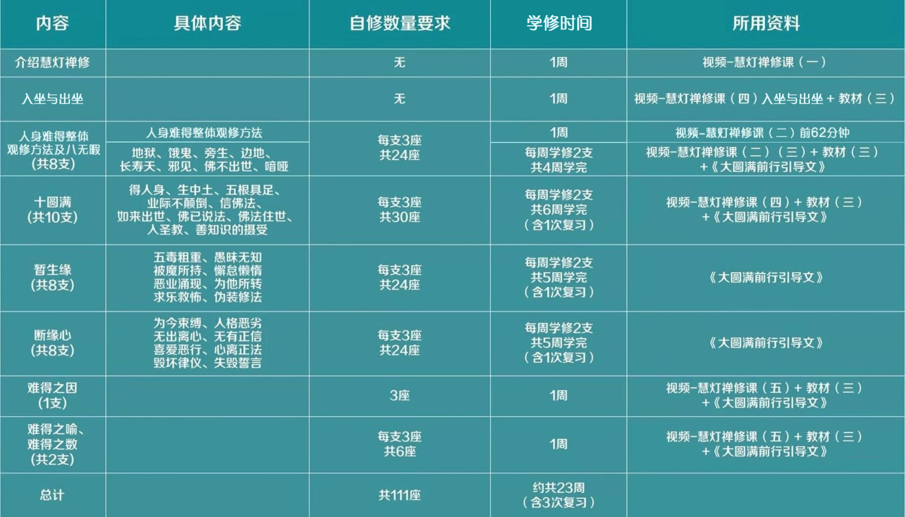

# 入坐与出坐及人身难得自修与学修安排

入坐与出坐及人身难得 自修与学修安排

HDZG\_ZEN 慧灯之光禅修 9/17

一、上师要求

1

人身难得共37支修法，需按照次第，逐支完成。

2

自修总数量：每支修3座，总计111座。

3

每日自修要求：每日1座，每座1小时。

二、所用资料

1.必修资料

1

视频-慧灯禅修课（一）~（五）+《慧灯禅修教材》（三） +《大圆满前行引导文》。

* 视频-慧灯禅修课（二）的前62分钟，是“人身难得”整体观修方法的讲解，学修时建议着重学习，并在整个学修期间适当穿插复习。

2

暂生缘与断缘心：详见《大圆满前行引导文》，可参考《前行备忘录》。

2.辅助参考资料:《菩提道次第广论》和《前行备忘录》。

※《大圆满前行引导文》，又名《大圆满前行 普贤上师言教》。

备注：必修资料在学修时学习，辅助参考资料是自学内容，不在学修时学习。

三、人身难得 自修与学修的安排建议

（建议23周，约6个月学修完，含4次复习）

• END •

