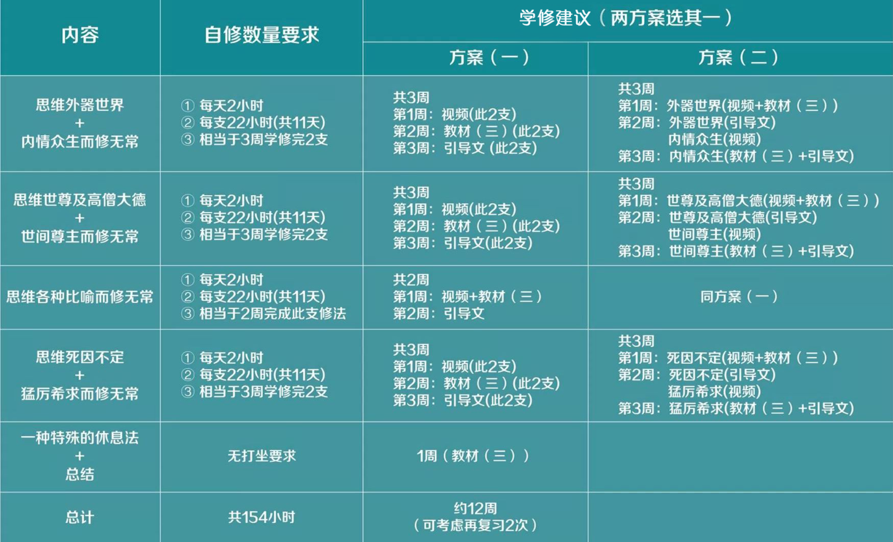

# 寿命无常 自修与学修安排

寿命无常 自修与学修安排

HDZG\_ZEN 慧灯之光禅修 9/17

一、上师要求

1

寿命无常共7支修法，需按照次第，逐支完成。

2

自修总数量：每支修22小时，总计154小时。

3

每日自修要求：每日2座，每座1小时。

二、所用资料

1

视频—慧灯禅修课（六~八）寿命无常

2

《慧灯禅修教材》（三）

3

《大圆满前行引导文》，又名《大圆满前行 普贤上师言教》，下文简称“引导文”。

4

辅助参考资料:《菩提道次第广论》和《前行备忘录》。

三、寿命无常 自修与学修的安排建议

（建议12周，约3~4个月学修完）

• END •

