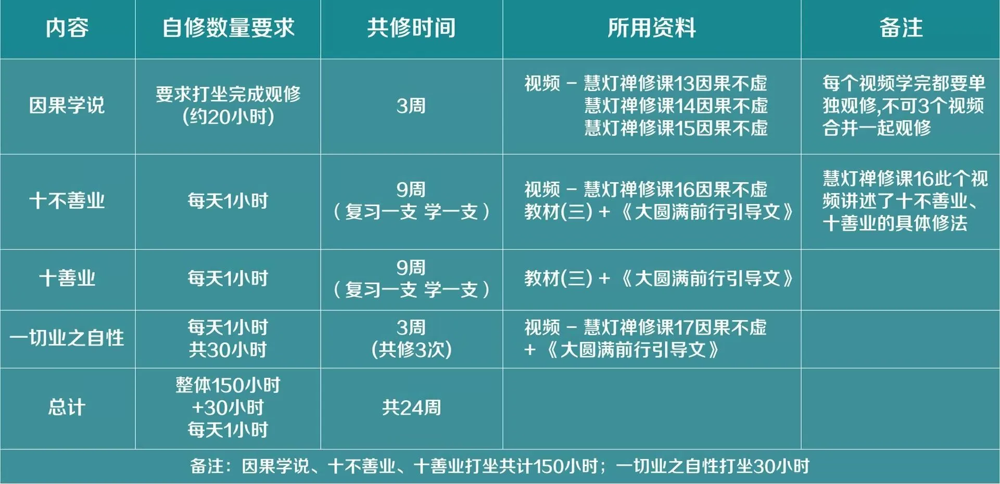
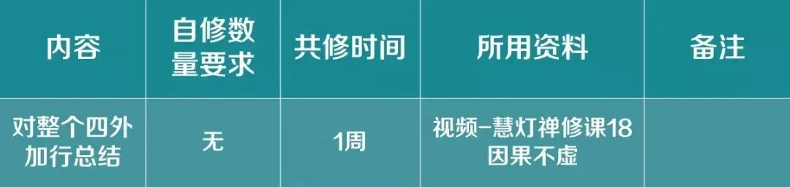
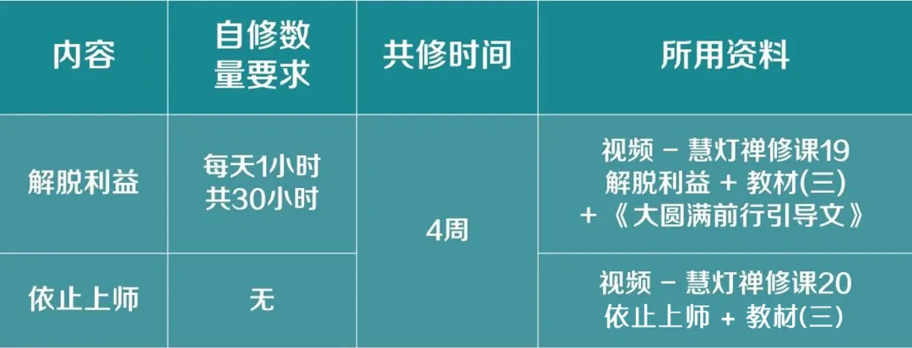

# 因果不虚及其他修法 自修与学修安排

因果不虚及其他修法 自修与学修安排

HDZG\_ZEN 慧灯之光禅修 9/17

一、上师要求

1

对因果学说生起认识：有3个慧灯禅修课视频讲因果学说，每学完1个视频都要单独观修，不可3个视频合并一起观修。

2

按照次第完成（先学修因果学说，再学修十不善业、十善业、一切业之自性，逐一完成）。

3

十不善业、十善业每支都要观修，每支数量自己决定，能生起因果不虚感觉的那支可多观修。也可一座里2~3支合并观修，但最好一座观修1支。

4

因果自修总数量：因果150小时+30小时（一切业之自性），约6个月左右完成。

5

解脱利益自修数量：30小时，约1个月完成。

6

每日自修要求：每天1座，每座1小时。

二、所用资料

1.必修资料

视频-慧灯禅修课（13~18）因果不虚 +《慧灯禅修教材》（三）+《大圆满前行引导文》

※《大圆满前行引导文》，又名《大圆满前行 普贤上师言教》。

2.辅助参考资料

1

《佛说稻秆经》。上师在慧灯禅修视频中反复强调《佛说稻秆经》的重要性，学习《佛说稻秆经》能帮助我们了解因果，并提出坐上观修此经内容的要求。故建议学习《佛说稻秆经》（1~4课视频）并打坐。

2

如果要更多了解因果，可以阅读《百业经》《贤愚经》《正法念处经》《大乘阿毗达磨集论》。

备注

① 必修资料在学修时学习，辅助参考资料是自学内容，不在学修时学习。

②《佛说稻秆经》（1~4课视频），各位可自行决定是学修学习还是自学。

三、因果不虚 自修与学修安排建议

（建议24～25周，约6个月修学完）

此外，在视频慧灯禅修课18 因果不虚中，上师对整个四外加行做了总结，提出了自检合格标准，可以安排1周学习这个视频。

四、其他修法 自修与学修安排建议

（建议4周修学完）

• END •

