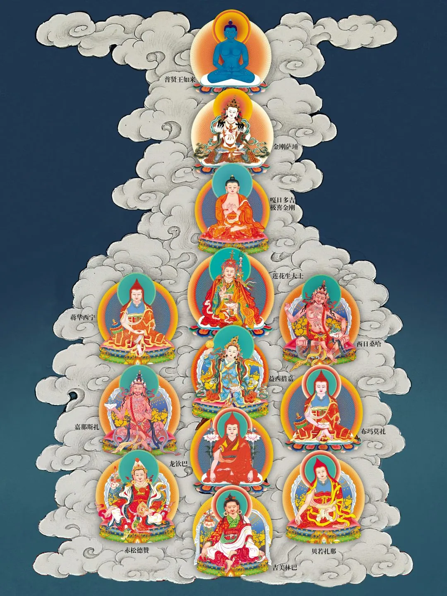

# 五加行学修说明——皈依

**一、皈依学修需要具备哪些条件**

皈依是五加行的第一个修法，进入五加行的学修条件是：圆满前三册教材的学习，四外加行自修量100%完成，学修出勤率达到70%。

**二、学修流程和《开显解脱道》的念诵方法**

请参见“四外加行”学修说明。

**三、皈依修法的考勤要求**

皈依修法的学修与自修不能少于4个月，约17周完成。

**四、皈依修法的自修要求**

1.自修数量：坐上如法完成11万遍的皈依偈念诵。

2.完成时间：4个月完成，建议每天1小时。

3.皈依偈（了解汉语意思，念诵藏文音译）

那葵内色那卡刚瓦耶 

安住虚空遍满虚空者

喇嘛耶丹堪竹措南当

上师本尊空行诸会众

桑吉秋当帕波给登拉

诸佛正法以及圣众前

达当桌折给贝嘉色切

我与六道众生敬皈依

**五、所用资料**

1.必修资料：视频-慧灯禅修课（21~23）+《大圆满前行引导文》

2.皈依境：附后

3.辅助参考资料：《前行备忘录》  

备注：必修资料在学修时学习，辅助参考资料是自学内容，不在学修时学习。

**六、皈依修法的学修安排具体建议**

**时间**

**学修内容建议**

第1周

① 皈依的学修说明

② 视频：慧灯禅修课21 加行的修法—皈依1

第2周

视频：慧灯禅修课22 加行的修法—皈依2

第3周

视频：慧灯禅修课23 加行的修法—皈依3

第4周

《大圆满前行引导文》不共内加行皈依部分

第5-17周

方案1

按照皈依的主要内容分为几个主题：功德、信心、学处、具体修法、传承上师功德等，各位可以灵活安排。按照主题汇集视频和法本内容，每次学修只针对某个主题进行，几个主题依次进行。

几个主题全部学完后，可挑重点、难点部分再次学习。

方案2

① 慧灯禅修课视频21~23，每个视频分2次学修。

② 大圆满前行引导文分2次学修。

然后①与②循环反复。

方案3

方案1与方案2结合使用。

**七、提前为五加行其他修法所做准备工作**

五加行的后四个修法中，金刚萨埵修法、上师瑜伽修法，需获得灌顶后方可修行。

**附 皈依境**

01

 皈依境全图

02

 皈依境局部图1

03

皈依境局部图2

 **• END •**   
  

